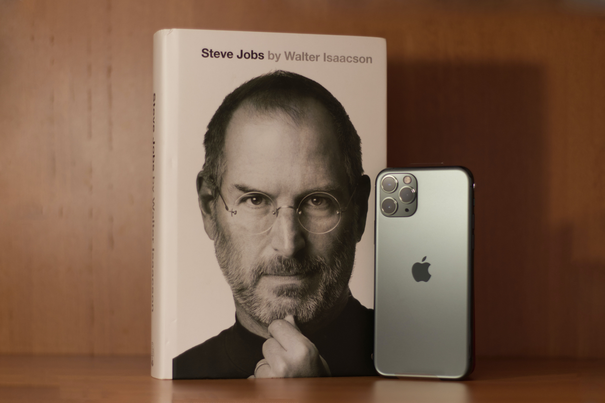

You are You
And You are Now
You are New 
And You are Wow

###### "It's not magic , Its logic , Its code , It's Computer Science!" ~ CAPTAIN

A mentor is someone who allows you to see the hope inside yourself.” — Oprah Winfrey 

## Bonus Projects made by Champions of the course (for the community):

	1. A simple rock paper scissors game built with C++
https://github.com/mansijain014/RockPaperScissors

###### If you love creating tutorials and would like to create a video series explaining a concept as such that a beginner will also understand , we love you then.We will feature all submissions on Aadhar Bhatnagar YT channel and the top ones will each recieve an Amazon Giftcards and your tutorials will be savoured for generations of coders pack to come .Additionally you can put those videos on your channels as well .Your name will be featured in the Contributors website and this can be a good medium to start your journey in tech ! It is totally voluntary and MyCaptain has no role in this .This is just a way to give back to the community .

# How was your expereince with us ? Do you have any suggestions for us or some heartfelt praise . Wanna Let us know .Yes , then do so by giving us an honest review at https://www.quora.com/Should-I-join-MyCaptain-Coder%E2%80%99s-Pack-Is-it-beneficial?q=MyCaptain%20Coders ❤️ ✍️ 
